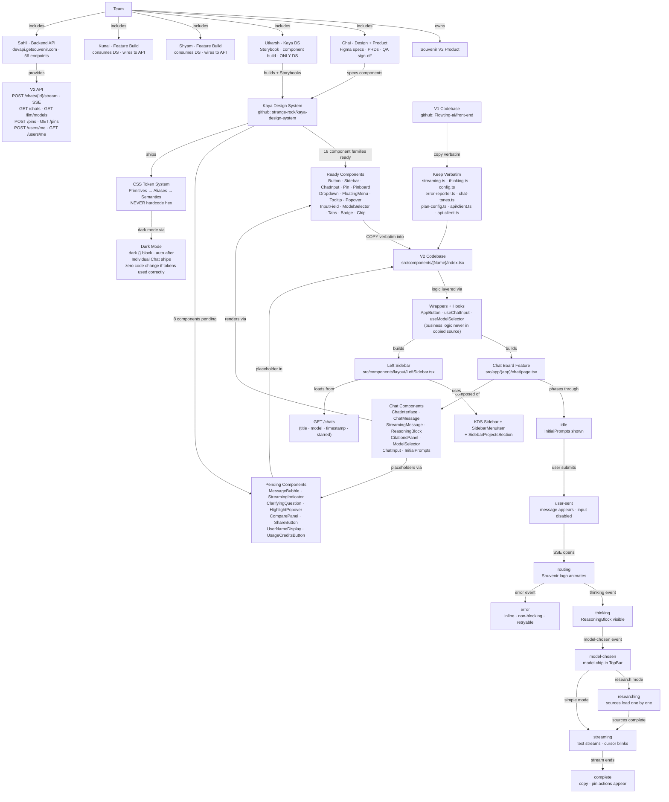

# Master Concept Map — Souvenir V2 Frontend

A single Mermaid diagram synthesising the full system: team, process, codebase layers, and feature architecture.

**To paste into FigJam:** `/` → type "Mermaid" → paste diagram below → Insert.

---

---

## Reading the map

| Cluster | What it shows |
|---------|--------------|
| Team | Who does what — Utkarsh = DS only, Shyam/Kunal = features |
| Design System | What's ready vs pending, and the copy-not-import mechanism |
| V2 Codebase | How copied components get business logic layered on top |
| Chat Feature | The 10-phase chat state machine and its component composition |
| Left Sidebar | Separate feature, simpler state, same copy pattern |
| Token System | Why no hex values, and how dark mode arrives for free |
| V1 Lib Files | The 8 files Shyam copies verbatim — no rewriting |
