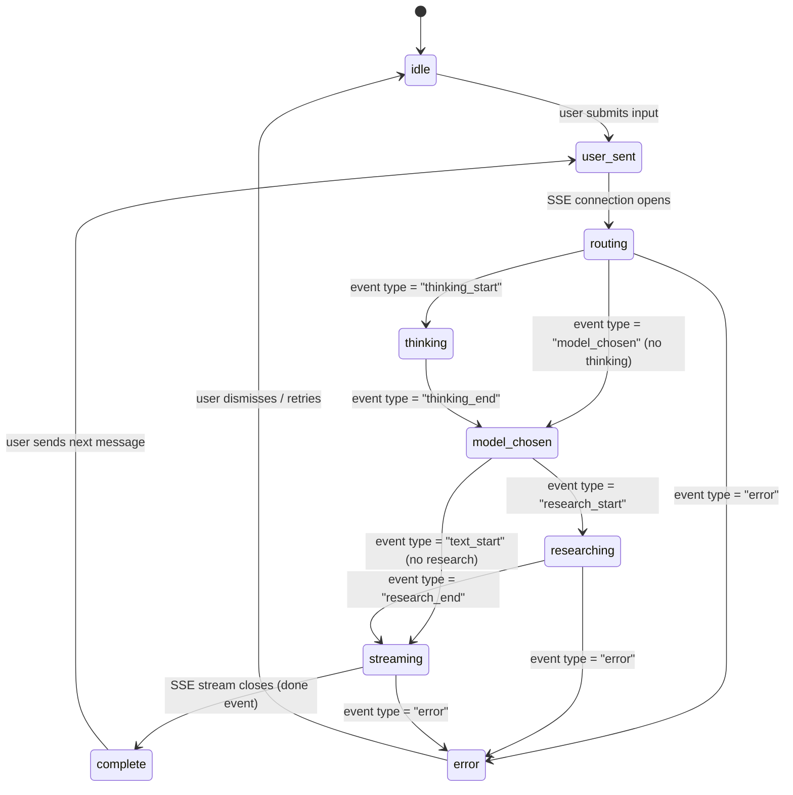

# Feature: Chat Board

The primary surface of the V2 app. A user sends a message, Souvenir routes it, a model responds, and the conversation builds up over time. Every other feature (pinning, highlighting, compare) surfaces from within this board.

**Entry point:** `src/app/(app)/chat/page.tsx`  
**Root component:** `src/components/chat/ChatInterface.tsx`  
**Primary hook:** `src/hooks/use-streaming-chat.ts` (already built, Day 5)

---

## Component Tree

```
ChatInterface
├── TopBar                          (layout/TopBar.tsx)
│   ├── model chip                  ← updates during model-chosen phase
│   ├── ShareButton                 ← PENDING (placeholder from docs/0)
│   ├── UserNameDisplay             ← PENDING (placeholder from docs/0)
│   └── UsageCreditsButton          ← PENDING (placeholder from docs/0)
│
├── message list (scrollable)
│   ├── InitialPrompts              ← visible in idle phase only
│   └── [per message]
│       ├── MessageBubble           ← PENDING (placeholder from docs/0)
│       │   ├── [user] plain text
│       │   └── [assistant]
│       │       ├── ReasoningBlock  ← collapsible, thinking phase
│       │       ├── StreamingMessage ← streaming phase
│       │       ├── CitationsPanel  ← after complete, if sources exist
│       │       └── HighlightPopover ← PENDING, on text selection
│       └── StreamingIndicator      ← PENDING, during routing/thinking phases
│
├── ResearchPanel                   ← visible during researching phase
│   └── [per source] ActivityRow
│
└── ChatInput                       ← KDS component (copy done)
    ├── PinMentionDropdown          ← Day 7 component
    └── AttachmentManager
```

---

## Chat State Machine

10 phases. The state machine lives in `src/hooks/use-chat-state.ts`.



### What renders in each phase

| Phase | Input | TopBar | Message area | Research panel |
|-------|-------|--------|-------------|----------------|
| `idle` | Enabled | Static | InitialPrompts | Hidden |
| `user-sent` | Disabled | Static | User bubble appears | Hidden |
| `routing` | Disabled | Souvenir logo animates | StreamingIndicator | Hidden |
| `thinking` | Disabled | Souvenir logo | ReasoningBlock (live steps) | Hidden |
| `model-chosen` | Disabled | Model chip fades in | ReasoningBlock collapses | Hidden |
| `researching` | Disabled | Model chip | StreamingIndicator | Sources load one by one |
| `streaming` | Disabled | Model chip | Text streams in | Sources collapse to pill |
| `complete` | Enabled | Model chip | Full message, copy/pin actions visible | Collapsed pill |
| `error` | Enabled | Static | Inline error card in message | Hidden or partial |

---

## API Wiring

### Create a new chat
```ts
POST /chats/create
Body: { title?: string }
Response: { id: string, title: string, created_at: string }
```

### Send a message and stream the response
```ts
POST /chats/{chatId}/stream
Headers: { Authorization: 'Bearer <token>' }
Body: {
  input: string,                    // user's message text
  algorithm?: 'base' | 'pro',       // Souvenir auto-routing (use this by default)
  model_id?: string,                 // direct model UUID (if user pinned a model)
  pin_ids?: string[],                // @-mentioned pins
  reference_message_id?: string,     // reply-to message ID (V2 feature)
  files?: { id: string }[],          // uploaded file IDs
  use_mistral_ocr?: boolean,         // power plan only
}
Response: SSE stream (see SSE Events below)
```

Note: use `algorithm` OR `model_id` — never both in the same request.

### SSE Events

Parse via `src/lib/streaming.ts` (`mergeStreamingText`). Raw event types from the stream:

| Event type | Data | Action |
|------------|------|--------|
| `thinking_start` | — | Transition to `thinking` phase, show ReasoningBlock |
| `thinking_delta` | `{ content: string }` | Append to ReasoningBlock |
| `thinking_end` | — | Seal ReasoningBlock |
| `model_chosen` | `{ model_id, model_name }` | Transition to `model-chosen`, update TopBar chip |
| `research_start` | — | Transition to `researching`, show ResearchPanel |
| `research_source` | `{ title, url, snippet }` | Add one source row to ResearchPanel |
| `research_end` | — | Collapse ResearchPanel to pill, transition to `streaming` |
| `text_start` | — | Transition to `streaming`, create new assistant MessageBubble |
| `text_delta` | `{ content: string }` | Append to streaming message |
| `text_end` | — | Transition to `complete` |
| `error` | `{ code, message }` | Transition to `error`, render inline error card |
| `done` | — | Stream complete, unlock input |

### Stop a stream
```ts
POST /chats/{chatId}/stop
```
Call this when the user presses the stop button during streaming. Also abort the `AbortController` from the SSE request.

### Load chat history (for sidebar)
```ts
GET /chats
Response: { chats: { id, title, model_name, created_at, starred }[] }
```

### Load messages for a chat
```ts
GET /chats/{chatId}/messages
Response: { messages: Message[] }
```

### Pin a message
```ts
POST /pins/message/{messageId}
Body: { title?: string, tags?: string[] }
```

---

## Pending Components — Chat Board specific

All three TopBar additions and MessageBubble/StreamingIndicator are pending. Until they ship:

1. Import from `docs/0-pending-kds-components.md` — copy the placeholder code directly
2. The prop interface in that doc IS the final contract. Build your call sites to those props now.
3. When Utkarsh ships the real component, swap the import path. Zero other changes.

```tsx
// Day 6 — how your ChatMessage.tsx should call pending components
import { MessageBubble } from '@/components/MessageBubble'          // placeholder
import { StreamingIndicator } from '@/components/StreamingIndicator' // placeholder

// These call sites will work unchanged when real KDS components ship
<MessageBubble role="assistant">
  {content}
</MessageBubble>

<StreamingIndicator size="md" />
```

---

## Reasoning Block

Shown during the `thinking` phase. Uses V1's `extractThinkingContent()` from `src/lib/thinking.ts`.

```tsx
// Collapsed by default after thinking phase ends
// Expand on click
// Content: raw thinking text, monospace font, scrollable
// Header: "Reasoning · N steps" where N = step count parsed from thinking content
```

Animate open/close with Framer Motion. See `docs/animation-states.md` for the expand/collapse pattern.

---

## Message Actions (complete phase)

Appear after streaming ends. On hover over the message:
- Copy message text
- Pin message → `POST /pins/message/{id}`
- Reply to message (sets `reference_message_id` on next send)
- Compare response (pro/power only — gate with `canAccessFeature(plan, 'modelCompare')`)

---

## Citations Panel

Shown if the message has `sources` in the response. Appears as a collapsed panel below the message. Sources have: `title`, `url`, `snippet`, `favicon`.

During `researching` phase: sources appear one by one in the ResearchPanel above the input.  
During `complete` phase: ResearchPanel collapses, sources available in CitationsPanel on the message.

---

## InitialPrompts (idle state)

Shown only when:
1. The chat has no messages yet, AND
2. Phase is `idle`

Shows 3–4 suggested prompts. Clicking one fills the ChatInput and submits.

Source: static list or fetched from user's most-used patterns. For now, use `src/lib/greetings.ts`.
